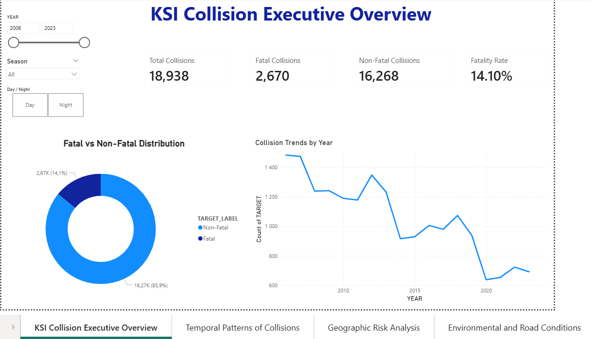
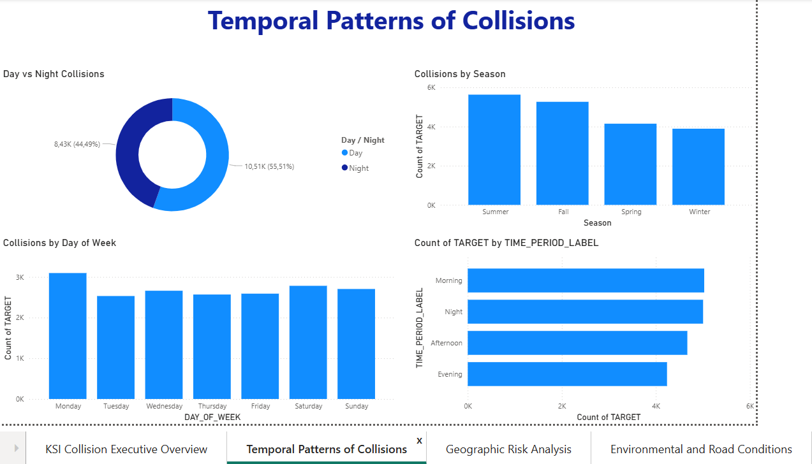
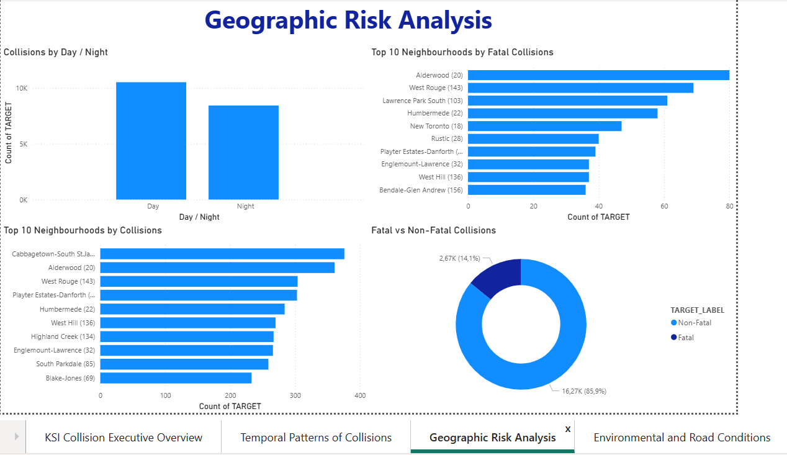
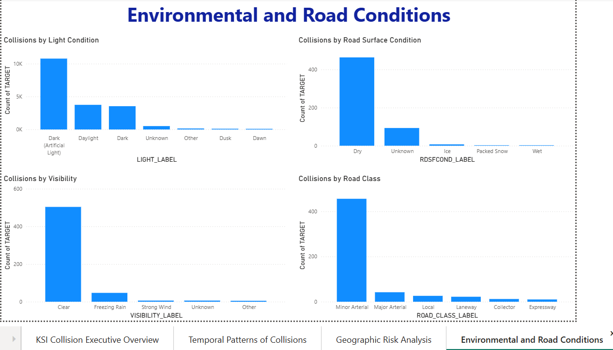

# KSI Toronto Collision Analysis

## Project Overview

This project analyzes Toronto Killed or Seriously Injured (KSI) collision data to identify traffic collision patterns, prepare the data for machine learning, build predictive models, and create an interactive Power BI dashboard.

The main goal is to predict whether a collision is likely to be:

- `0` = Non-Fatal
- `1` = Fatal

This project combines:

- Data Engineering
- Data Cleaning
- Feature Engineering
- Exploratory Data Analysis
- Machine Learning
- Prediction
- Power BI Dashboarding

---

## Dataset

The project uses Toronto KSI collision data related to people who were killed or seriously injured in traffic collisions.

The full dataset is not included in this repository to keep the repository lightweight. The dataset can be accessed from Toronto Police Service Public Safety Data Portal / Toronto Open Data sources.

---

## Project Workflow

```text
Raw Data
   ↓
Data Engineering
   ↓
Exploratory Data Analysis
   ↓
Data Cleaning and Feature Engineering
   ↓
Machine Learning Model Building
   ↓
Prediction
   ↓
Power BI Dashboard
   ↓
GitHub Portfolio Project
```

---

## Repository Structure

```text
KSI-Toronto-Collision-Analysis/
│
├── notebooks/
│   ├── KSI_Step1_EDA.ipynb
│   ├── KSI_Step2_Cleaning.ipynb
│   ├── KSI_Step3_Model_Building.ipynb
│   └── KSI_Step4_Prediction.ipynb
│
├── models/
│   ├── X_train.pkl
│   ├── X_test.pkl
│   ├── y_train.pkl
│   ├── y_test.pkl
│   └── prediction_results.csv
│
├── powerbi/
│   └── KSI_Toronto_PowerBI_Dashboard_Final.pbix
│
├── screenshots/
│   ├── 01_executive_overview.png
│   ├── 02_temporal_patterns.png
│   ├── 03_geographic_risk_analysis.png
│   └── 04_environmental_road_conditions.png
│
├── data/
│   └── README.md
│
├── .gitignore
├── LICENSE
├── model_card.md
├── README.md
└── requirements.txt
```

---

## Step 1 — Exploratory Data Analysis

The first step focused on understanding the dataset and identifying important patterns.

Main tasks included:

- loading and inspecting the dataset
- reviewing dataset structure and column types
- analyzing missing values
- analyzing the target variable
- exploring collision trends over time
- examining categorical variables
- comparing fatal and non-fatal collisions
- reviewing correlation patterns
- preparing data for visualization

---

## Step 2 — Data Cleaning, Preprocessing and Feature Engineering

The second step focused on preparing the dataset for machine learning.

Main tasks included:

- removing irrelevant rows and weak columns
- handling missing values
- creating date and time-based features
- creating geographic risk features
- handling rare categories
- encoding the target variable
- encoding categorical variables
- scaling numerical features
- splitting the data into training and testing sets
- applying SMOTE to handle class imbalance
- saving prepared datasets for modeling

Engineered features included:

- `WEEKEND`
- `SEASON`
- `MONTH_PART`
- `DAY_NIGHT`
- `TIME_PERIOD`
- `RUSH_HOUR`
- `HIGH_RISK_NEIGHBOURHOOD`

---

## Step 3 — Machine Learning Model Building

Five supervised classification models were trained and evaluated:

- Logistic Regression
- Decision Tree
- Random Forest
- SVM
- Neural Network

The models were evaluated using:

- Accuracy
- Precision
- Recall
- F1-Score
- ROC-AUC
- Confusion Matrix
- Classification Report

---

## Model Comparison Results

| Model | Accuracy | Precision | Recall | F1-Score | ROC-AUC |
|---|---:|---:|---:|---:|---:|
| Logistic Regression | 0.6233 | 0.2061 | 0.5861 | 0.3049 | 0.6509 |
| Decision Tree | 0.8904 | 0.6049 | 0.6423 | 0.6231 | 0.7866 |
| Random Forest | 0.9314 | 0.9790 | 0.5243 | 0.6829 | 0.9339 |
| SVM | 0.8699 | 0.5375 | 0.5506 | 0.5439 | 0.8375 |
| Neural Network | 0.8976 | 0.6209 | 0.7022 | 0.6591 | 0.8906 |

---

## Best Model

Random Forest was selected as the best overall model.

It achieved the strongest overall performance with the highest:

- Accuracy
- Precision
- F1-Score
- ROC-AUC

Although the Neural Network achieved higher recall, Random Forest provided the best overall balance between predictive performance and reliability.

---

## Step 4 — Prediction

The saved Random Forest model was used to generate predictions on the test dataset.

This step included:

- loading the saved model
- loading test data
- generating predictions
- generating fatality probabilities
- comparing actual vs predicted results
- analyzing incorrect predictions
- saving prediction results to CSV

The final prediction output was saved as:

```text
models/prediction_results.csv
```

---

## Trained Model Availability

The final trained Random Forest model file (`best_random_forest_model.pkl`) is not included in this repository due to file size limitations.

To reproduce the model, run the following notebook:

```text
notebooks/KSI_Step3_Model_Building.ipynb
```

This notebook trains five classification models, compares their performance, selects Random Forest as the best overall model, and saves the trained model locally.

The repository still includes:

- prepared train/test files
- prediction results
- model evaluation outputs
- the full model-building notebook

---

## Power BI Dashboard

An interactive Power BI dashboard was created with four pages:

1. Executive Overview
2. Temporal Patterns of Collisions
3. Geographic Risk Analysis
4. Environmental and Road Conditions

### Page 1 — Executive Overview



### Page 2 — Temporal Patterns



### Page 3 — Geographic Risk Analysis



### Page 4 — Environmental and Road Conditions



---

## Key Insights

Some key findings from the project include:

- Fatal collisions represent a minority class, making class imbalance an important issue.
- Time-based features such as day/night, rush hour, season, and time period are useful for understanding collision patterns.
- Geographic patterns show that some neighbourhoods have higher collision frequencies.
- Environmental and road conditions help provide additional context for collision analysis.
- Random Forest produced the best overall machine learning performance.

---

## Technologies Used

- Python
- Pandas
- NumPy
- Scikit-learn
- imbalanced-learn
- Matplotlib
- Jupyter Notebook
- Power BI
- GitHub

---

## How to Run the Project

1. Clone this repository.

2. Install the required libraries:

```bash
pip install -r requirements.txt
```

3. Run the notebooks in order:

```text
notebooks/KSI_Step1_EDA.ipynb
notebooks/KSI_Step2_Cleaning.ipynb
notebooks/KSI_Step3_Model_Building.ipynb
notebooks/KSI_Step4_Prediction.ipynb
```

4. Open the Power BI file:

```text
powerbi/KSI_Toronto_PowerBI_Dashboard_Final.pbix
```

---

## Project Status

The project currently includes:

- Complete EDA
- Complete data cleaning and preprocessing
- Complete feature engineering
- Complete Power BI dashboard
- Complete model building and evaluation
- Complete prediction workflow

---

## Author

**Mohcine Behate**

Data Analytics and Machine Learning Project  
Centennial College
